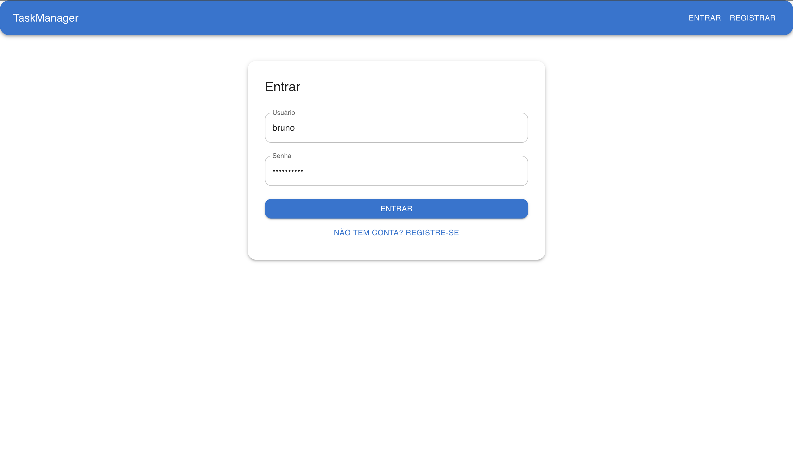
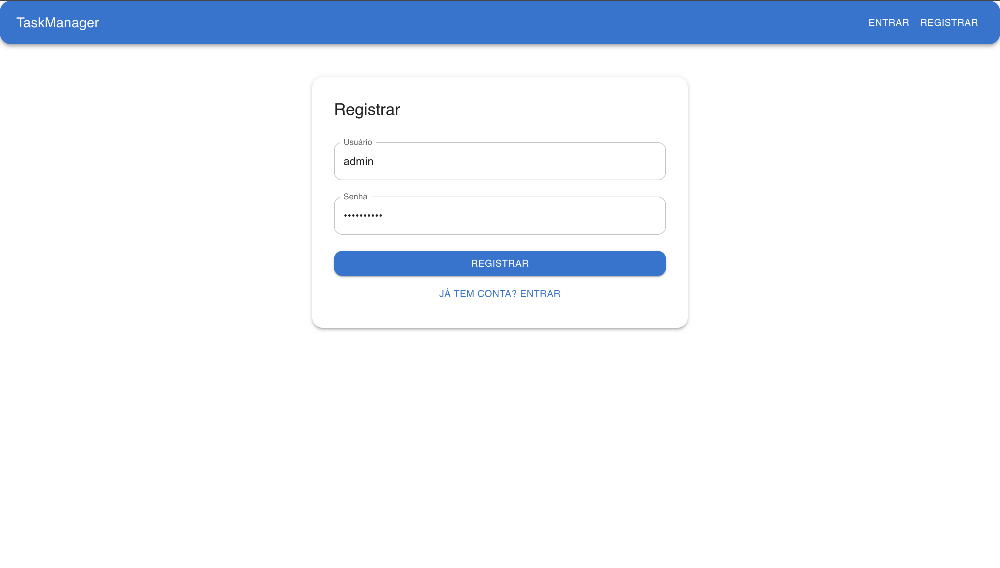
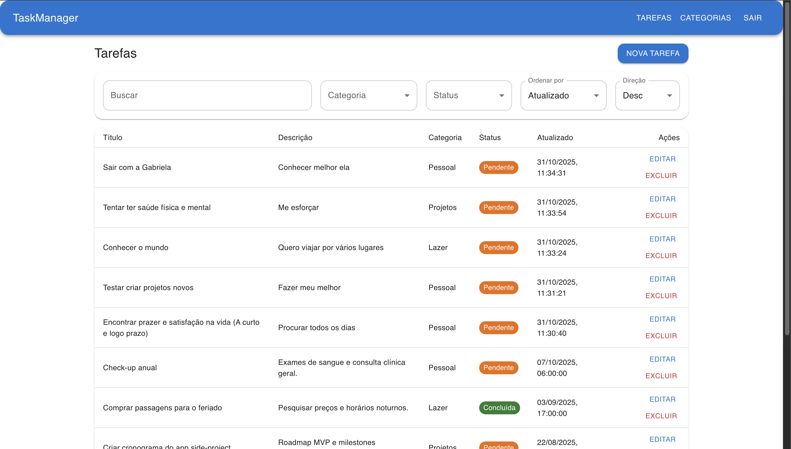
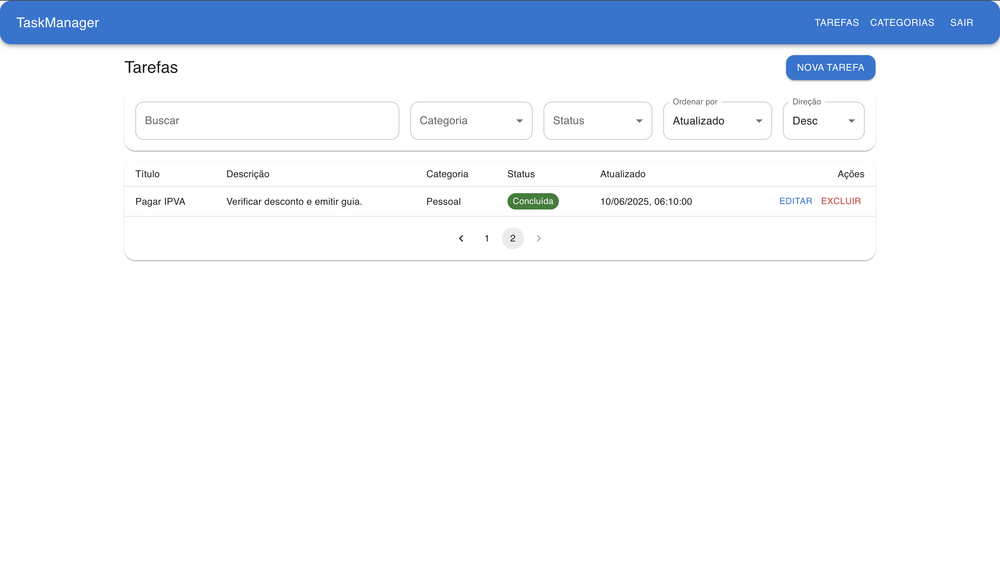
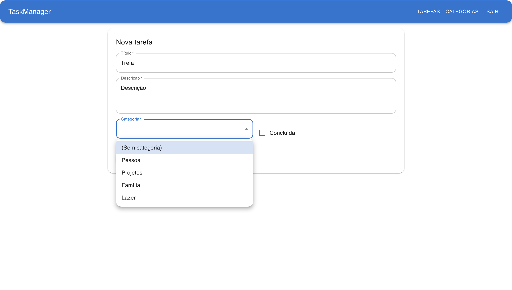
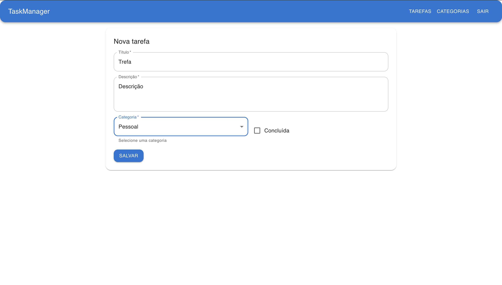
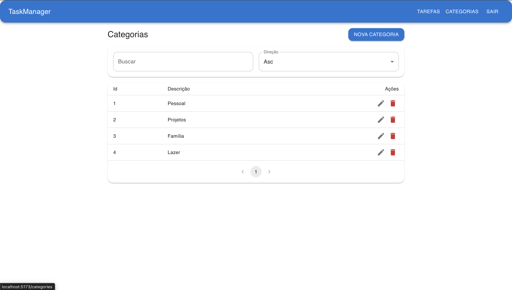
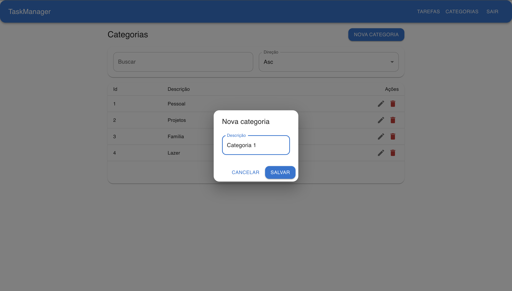

# Task Manager Application

[🇧🇷 Leia em Português](./README.md)

A complete application for **task and category management**, developed with **.NET 10 (ASP.NET Core Web API)** on the backend and **React + TypeScript + Material UI** on the frontend.
The system allows **JWT authentication**, **CRUD of tasks and categories**, **advanced filters**, **pagination**, and **modern responsive interface**.

---

## 🧩 Key Features

- ✅ User registration and authentication with **JWT**
- 🧾 Complete **Task** CRUD
- 🗂️ **Category** CRUD
- 🔍 Filters by **status**, **category**, **text**, and **sorting**
- 📆 Result pagination
- 🎨 Modern interface with **Material UI**
- 🌐 REST API documented and structured in **independent controllers**

---

## 🏗️ Project Structure

```
aplicacao-de-gerenciamento-de-tarefas-main/
│
├── TaskManagerApi/              # Backend in .NET 10
│   ├── Controllers/             # Main endpoints (Auth, Tasks, Categories)
│   ├── DTOs/                    # Data Transfer Objects
│   ├── Models/                  # Domain Models (User, Task, Category)
│   ├── Services/                # JWT and authentication logic
│   ├── Data/                    # Database Context (Entity Framework)
│   └── Program.cs               # Application configuration and routes
│
├── taskmanager-ui/              # Frontend React + TypeScript
│   ├── src/api/                 # Communication with backend
│   ├── src/auth/                # Authentication context and control
│   ├── src/pages/               # Main pages (Login, Tasks, Categories)
│   └── src/components/          # Reusable components (NavBar, Dialogs, etc.)
│
└── README.md                    # This file
```

---

## ⚙️ Requirements

### Backend (.NET 10)

- [.NET SDK 10.0](https://dotnet.microsoft.com/en-us/download)
- [PostgreSQL](https://www.postgresql.org/download/)

### Frontend (Node.js)

- [Node.js 18+](https://nodejs.org/)
- [npm](https://www.npmjs.com/)

### Infrastructure

- [Docker](https://www.docker.com/products/docker-desktop/) (Optional, but recommended)

---

## 🐳 Running with Docker (Recommended)

The easiest way to run the project is using the included automation scripts, which configure the entire environment (API, UI, and Database) via Docker.

### Linux / WSL
```bash
./build_and_deploy.sh
```

### macOS
```bash
./build_and_deploy_mac.sh
```

### Windows (PowerShell)
```powershell
.\build_and_deploy.ps1
```

> **Note:** The script will build the images, create containers, and start the application.
> - **API:** http://localhost:8080
> - **Frontend:** http://localhost:3000

---

## 🛠️ Manual Execution (Development)

### 1. Clone the repository

```bash
git clone https://github.com/thiagosmota/aplicacao-de-gerenciamento-de-tarefas.git
cd aplicacao-de-gerenciamento-de-tarefas-main
```

### 2. Configure the backend

```bash
cd TaskManagerApi/TaskManagerApi
dotnet restore
dotnet ef database update
dotnet run
```

By default, the server runs at:

```
http://localhost:5000
```

---

### 3. Configure the frontend

```bash
cd taskmanager-ui
npm install
npm run dev
```

By default, the server runs at:

```
http://localhost:3000
```

> **Note on Ports:**
> * **Docker:** API on port `8080` and UI on port `3000`.
> * **Manual:** API on port `5000` (.NET default) and UI on port `3000` (Vite).


---

## 🔑 JWT Authentication

Authentication uses **Bearer Token**, generated at login.
The token is stored in `localStorage` and automatically included in Axios request headers.

Header example:

```http
Authorization: Bearer <token>
```

Token expiration is configured in `appsettings.json`:

```json
"Jwt": {
  "AccessTokenMinutes": 120
}
```

Everything else is configured in `.env` as they are sensitive data. Something like:

```env
Jwt__Issuer=TaskManagerApi
Jwt__Audience=TaskManagerApi
Jwt__Key=E%7@J5@4#1IGn&!T2p6hPEE%6x$5%X@1
```

---

## 🧠 API Endpoints

### 🔐 Authentication (`/auth`)

| Method | Endpoint         | Description                          |
| ------ | ---------------- | ------------------------------------ |
| POST   | `/auth/register` | Creates a new user                   |
| POST   | `/auth/login`    | Returns JWT Token and user data      |

---

### 📋 Tasks (`/api/tasks`)

| Method | Endpoint          | Description                             |
| ------ | ----------------- | --------------------------------------- |
| GET    | `/api/tasks`      | Lists tasks (with filters and pagination) |
| GET    | `/api/tasks/{id}` | Returns specific task                   |
| POST   | `/api/tasks`      | Creates new task                        |
| PUT    | `/api/tasks/{id}` | Updates existing task                   |
| DELETE | `/api/tasks/{id}` | Removes task                            |

**Example of supported filters:**

```json
{
  "CategoryId": 1,
  "IsCompleted": false,
  "Search": "Report",
  "SortBy": "updatedAt",
  "SortDir": "desc",
  "Page": 1,
  "PageSize": 10
}
```

For more, [📄 Filters Documentation](./TaskManagerApi/docs/Filters.md).

---

### 🗂️ Categories (`/api/categories`)

| Method | Endpoint               | Description                  |
| ------ | ---------------------- | ---------------------------- |
| GET    | `/api/categories`      | Lists categories with filters |
| POST   | `/api/categories`      | Creates new category         |
| PUT    | `/api/categories/{id}` | Updates category             |
| DELETE | `/api/categories/{id}` | Removes category             |

---

## 🧮 Database

The system uses **Entity Framework Core** and **PostgreSQL**.
The connection is configured in `appsettings.json` or `.env`:

In `appsettings.json`:

```json
"ConnectionStrings": {
  "DefaultConnection": "Host=localhost;Database=TaskManager;Username=postgres;Password=admin"
}
```

In `.env`:

```env
ConnectionStrings__Default=Host=localhost;Database=TaskManager;Username=postgres;Password=admin;
```

To learn about database configuration and usage [🗄️ Database Guide](./TaskManagerApi/docs/Database.md)

---

## 🧰 Tech Stack

| Layer        | Technology                                 |
| ------------ | ------------------------------------------ |
| Backend      | ASP.NET Core 10, Entity Framework Core, JWT |
| Database     | PostgreSQL                                 |
| Frontend     | React + TypeScript                         |
| UI           | Material UI (MUI)                          |
| Communication| Axios                                      |
| Authentication| JWT Bearer                                |

---

## 📸 Images and Examples

### 📋 Login and Register Screen

Modern and responsive interface, with integrated JWT authentication.

#### Login.tsx:



#### Register.tsx:



### 🗂️ Filters and Task Listing

Interface with **search**, **sorting**, **pagination**, and **dynamic filters**.

#### Tasks.tsx:









### 🗂️ Categories.tsx





### 🧱 Backend Structure

Independent controllers and clear REST endpoints.
_(Based on files `TasksController.cs`, `CategoriesController.cs` and `AuthController.cs`)_

---

## 🧩 How `.env` works in this project

The project uses the **[DotNetEnv](https://www.nuget.org/packages/DotNetEnv)** package to allow using environment variables defined in a `.env` file.
This mechanism serves to **remove sensitive information** from `appsettings.json` (like passwords, JWT keys, and URLs) and **keep them out of versioned code**.
For more details, [⚙️ .env Configuration](./TaskManagerApi/docs/EnvironmentVariables.md)

---

## 🧾 Credits

**Author:** Thiago Soares Mota

**License:** MIT
