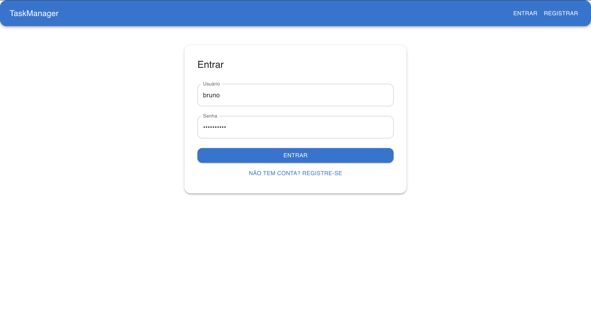
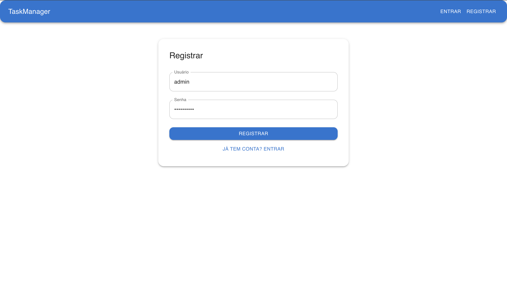
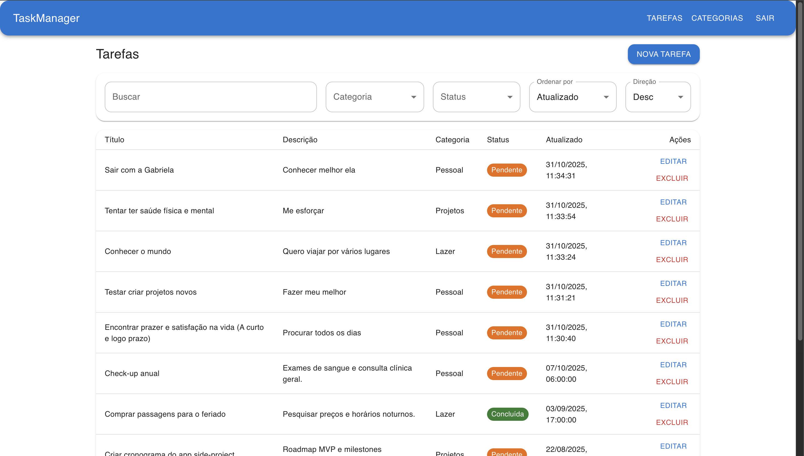
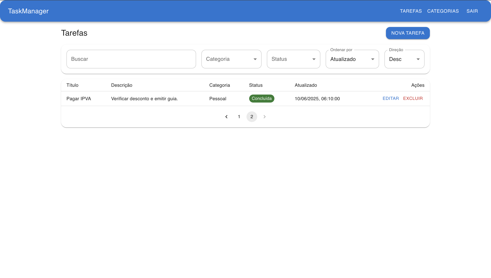
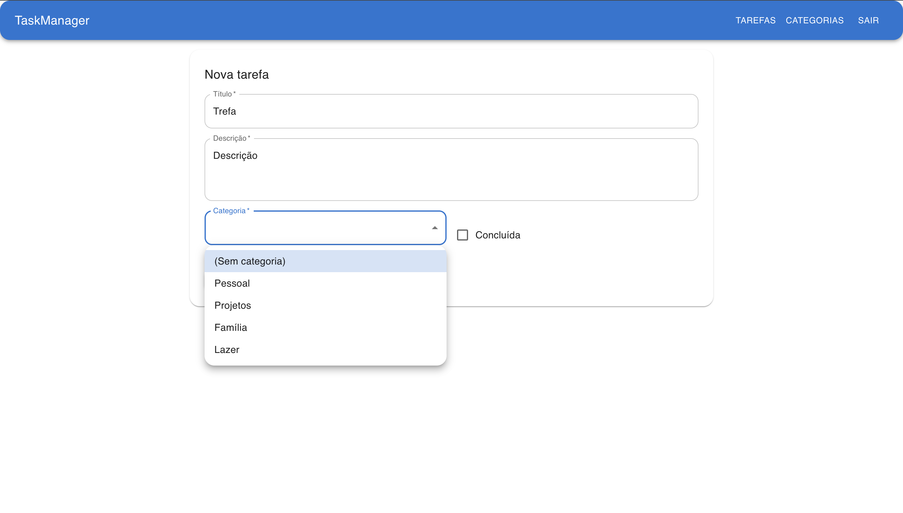
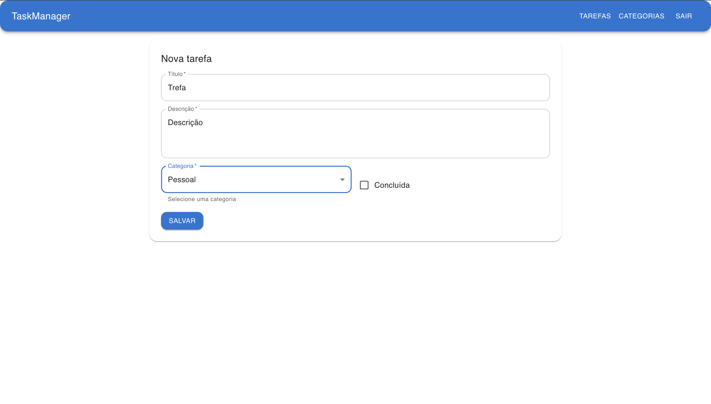
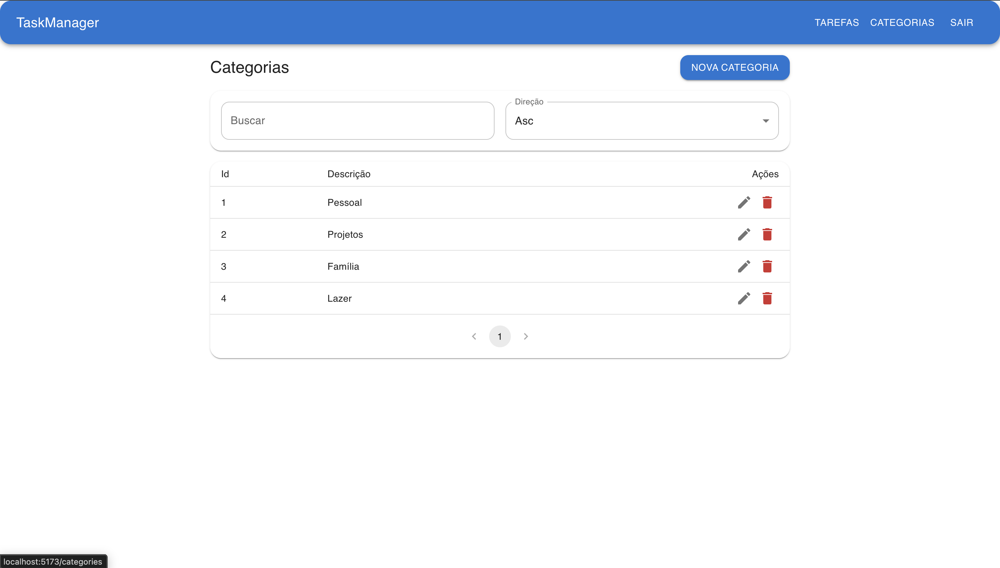

# Aplicação de Gerenciamento de Tarefas (Task Manager)

Uma aplicação completa para **gerenciamento de tarefas e categorias**, desenvolvida com **.NET 9 (ASP.NET Core Web API)** no backend e **React + TypeScript + Material UI** no frontend.  
O sistema permite **autenticação JWT**, **CRUD de tarefas e categorias**, **filtros avançados**, **paginação**, e **interface moderna responsiva**.

---

## 🧩 Funcionalidades Principais

- ✅ Cadastro e autenticação de usuários com **JWT**
- 🧾 CRUD completo de **tarefas**
- 🗂️ CRUD de **categorias**
- 🔍 Filtros por **status**, **categoria**, **texto** e **ordenação**
- 📆 Paginação de resultados
- 🎨 Interface moderna com **Material UI**
- 🌐 API REST documentada e estruturada em **controllers independentes**

---

## 🏗️ Estrutura do Projeto

```
aplicacao-de-gerenciamento-de-tarefas-main/
│
├── TaskManagerApi/              # Backend em .NET 9
│   ├── Controllers/             # Endpoints principais (Auth, Tasks, Categories)
│   ├── DTOs/                    # Objetos de transferência de dados
│   ├── Models/                  # Modelos de domínio (User, Task, Category)
│   ├── Services/                # JWT e lógica de autenticação
│   ├── Data/                    # Contexto do banco de dados (Entity Framework)
│   └── Program.cs               # Configuração da aplicação e rotas
│
├── taskmanager-ui/              # Frontend React + TypeScript
│   ├── src/api/                 # Comunicação com o backend
│   ├── src/auth/                # Contexto e controle de autenticação
│   ├── src/pages/               # Páginas principais (Login, Tasks, Categories)
│   └── src/components/          # Componentes reutilizáveis (NavBar, Dialogs, etc.)
│
└── README.md                    # Este arquivo
```

---

## ⚙️ Requisitos

### Backend (.NET 9)

- [.NET SDK 9.0](https://dotnet.microsoft.com/en-us/download)
- [PostgreSQL](https://www.postgresql.org/download/)

### Frontend (Node.js)

- [Node.js 18+](https://nodejs.org/)
- [npm](https://www.npmjs.com/)

---

## 🚀 Executando o Projeto

### 1. Clonar o repositório

```bash
git clone https://github.com/thiagosmota/aplicacao-de-gerenciamento-de-tarefas.git
cd aplicacao-de-gerenciamento-de-tarefas-main
```

### 2. Configurar o backend

```bash
cd TaskManagerApi/TaskManagerApi
dotnet restore
dotnet ef database update
dotnet run
```

Por padrão, o servidor executa em:

```
http://localhost:5064
```

---

### 3. Configurar o frontend

```bash
cd taskmanager-ui
npm install
npm run dev
```

Por padrão, o servidor executa em:

```
http://localhost:5173
```

---

## 🔑 Autenticação JWT

A autenticação utiliza **Bearer Token**, gerado no login.
O token é armazenado no `localStorage` e incluído automaticamente nos headers das requisições Axios.

Exemplo de header:

```http
Authorization: Bearer <token>
```

O tempo do token é configurado no arquivo `appsettings.json`:

```json
"Jwt": {
  "AccessTokenMinutes": 120
}
```

Todo o resto é configurado no .env por serem dados senciveis. Algo como:

```env
Jwt__Issuer=TaskManagerApi
Jwt__Audience=TaskManagerApi
Jwt__Key=E%7@J5@4#1IGn&!T2p6hPEE%6x$5%X@1
```

---

## 🧠 Endpoints da API

### 🔐 Autenticação (`/auth`)

| Método | Endpoint         | Descrição                            |
| ------ | ---------------- | ------------------------------------ |
| POST   | `/auth/register` | Cria um novo usuário                 |
| POST   | `/auth/login`    | Retorna JWT Token e dados do usuário |

---

### 📋 Tarefas (`/api/tasks`)

| Método | Endpoint          | Descrição                               |
| ------ | ----------------- | --------------------------------------- |
| GET    | `/api/tasks`      | Lista tarefas (com filtros e paginação) |
| GET    | `/api/tasks/{id}` | Retorna tarefa específica               |
| POST   | `/api/tasks`      | Cria nova tarefa                        |
| PUT    | `/api/tasks/{id}` | Atualiza tarefa existente               |
| DELETE | `/api/tasks/{id}` | Remove tarefa                           |

**Exemplo de filtros suportados:**

```json
{
  "CategoryId": 1,
  "IsCompleted": false,
  "Search": "Relatório",
  "SortBy": "updatedAt",
  "SortDir": "desc",
  "Page": 1,
  "PageSize": 10
}
```

Para mais, [acesse essa pagina](./TaskManagerApi/docs/filtros.md).

---

### 🗂️ Categorias (`/api/categories`)

| Método | Endpoint               | Descrição                    |
| ------ | ---------------------- | ---------------------------- |
| GET    | `/api/categories`      | Lista categorias com filtros |
| POST   | `/api/categories`      | Cria nova categoria          |
| PUT    | `/api/categories/{id}` | Atualiza categoria           |
| DELETE | `/api/categories/{id}` | Remove categoria             |

---

## 🧮 Banco de Dados

O sistema utiliza **Entity Framework Core** e **PostgreSQL**.
A conexão é configurada em `appsettings.json` ou no `.env`:

No `appsettings.json`:

```json
"ConnectionStrings": {
  "DefaultConnection": "Host=localhost;Database=TaskManager;Username=postgres;Password=admin"
}
```

No `.env`:

```env
ConnectionStrings__Default=Host=localhost;Database=TaskManager;Username=postgres;Password=admin;
```

Para saber sobre configurações e uso do banco de dados [isso pode ajudar](./TaskManagerApi/docs/Dados.md)

---

## 🧰 Stack Tecnológica

| Camada       | Tecnologia                                 |
| ------------ | ------------------------------------------ |
| Backend      | ASP.NET Core 9, Entity Framework Core, JWT |
| Banco        | PostgreSQL                                 |
| Frontend     | React + TypeScript                         |
| UI           | Material UI (MUI)                          |
| Comunicação  | Axios                                      |
| Autenticação | JWT Bearer                                 |

---

## 📸 Imagens e Exemplos

### 📋 Tela de Login e Registro

Interface moderna e responsiva, com autenticação JWT integrada.

#### Login.tsx:



#### Register.tsx:



### 🗂️ Filtros e Listagem de Tarefas

Interface com **busca**, **ordenação**, **paginação** e **filtros dinâmicos**.

#### Tasks.tsx:









### 🗂️ Categories.tsx




### 🧱 Estrutura do Backend

Controllers independentes e endpoints REST claros.
_(Baseado nos arquivos `TasksController.cs`, `CategoriesController.cs` e `AuthController.cs`)_

---

## 🧩 Como o `.env` funciona neste projeto

O projeto utiliza o pacote **[DotNetEnv](https://www.nuget.org/packages/DotNetEnv)** para permitir o uso de variáveis de ambiente definidas em um arquivo `.env`.
Esse mecanismo serve para **retirar informações sensíveis** do `appsettings.json` (como senhas, chaves JWT e URLs) e **mantê-las fora do código versionado**.
Para mais detalhes, [acesse essa página](./TaskManagerApi/docs/envFiles.md)

---

## 🧾 Créditos

**Autor:** Thiago Soares Mota

**Licença:** MIT
